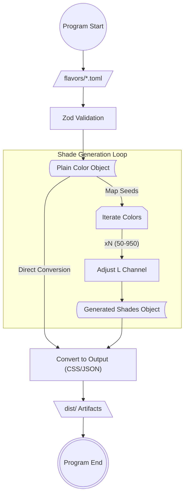

# Caelora Palette

Palettes of the planet that I imagined.

## TechStack

### Development Environments

- **Just**: A command runner to manage project tasks and automate development workflows.
- **Bun**: A fast all-in-one JavaScript runtime, test runner, and bundler.
- **GitHub Actions**: A CI/CD platform to automate testing and deployment processes.
- **JSR**: A modern package registry that natively supports TypeScript and ESM.

### Runtime Environments

- **TypeScript**: A strongly typed programming language that ensures color logic accuracy.
- **TOML**: A human-readable configuration format used for defining structured color data.
- **colord**: A library for color manipulation and conversion.
- **zod**: A schema validation library.
- **remeda**: A utility library for functional programming.

## Structure

```structure
/ -> configs, where the journey begins
/src/flavors/ -> all the base colour would be defined here
/src/core/ -> colours transformation algorithms
/src/utils/ -> utility functions for color manipulation
/src/index.ts -> entry point of the application
/src/cli.ts -> command line interface for interacting with the palette
/dist/-> compiled output of the palette
/dist/css -> compiled css output of the palette
/dist/toml -> compiled toml output of the palette
/dist/esm -> compiled esm output of the palette (with types)
```

## Architecture


